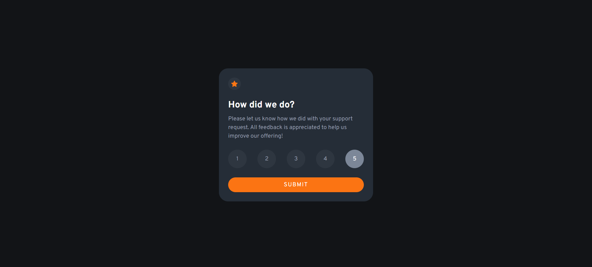
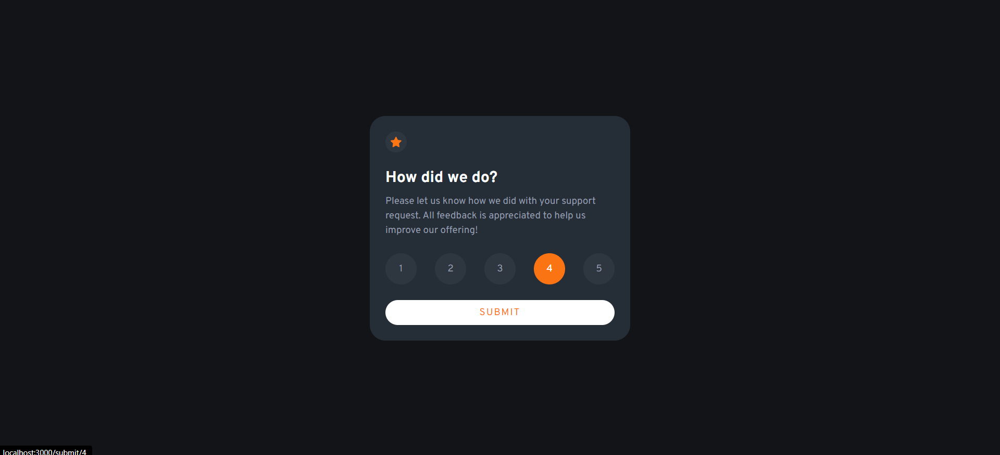
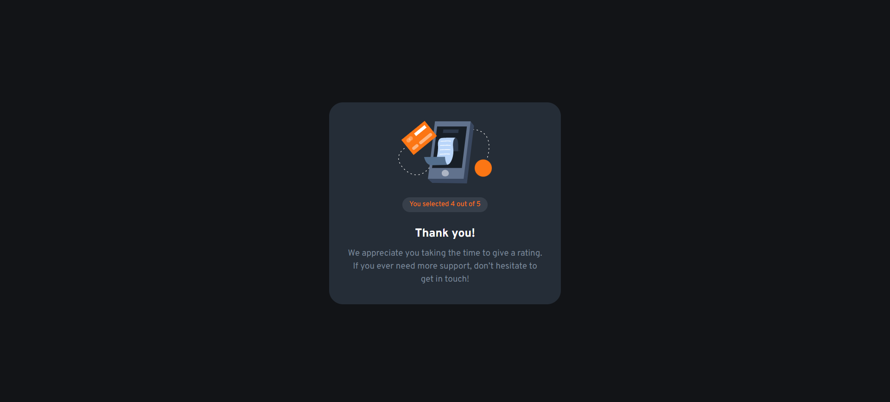

# Frontend Mentor - Interactive rating component solution using NEXT.JS 13

This is a solution to the [Interactive rating component challenge on Frontend Mentor](https://www.frontendmentor.io/challenges/interactive-rating-component-koxpeBUmI). Frontend Mentor challenges help you improve your coding skills by building realistic projects. 

## Table of contents

- [Overview](#overview)
  - [The challenge](#the-challenge)
  - [Screenshot](#screenshot)
  - [Links](#links)
- [My process](#my-process)
  - [Built with](#built-with)
  - [What I learned](#what-i-learned)
- [Author](#author)

## Overview

### The challenge

Users should be able to:

- View the optimal layout for the app depending on their device's screen size
- See hover states for all interactive elements on the page
- Select and submit a number rating
- See the "Thank you" card state after submitting a rating

### Screenshot






### Links

- Live Site URL: [unavailable](https://your-live-site-url.com)

## My process

### Built with

- Semantic HTML5 markup
- CSS custom properties
- Flexbox
- CSS Grid
- [React](https://reactjs.org/) - JS library
- [Next.js](https://nextjs.org/) - React framework

### What I learned

```useState()``` React and "Lifting State Up" method

## Author

- Github - [fiqihalfito](https://www.github.com/fiqihalfito)
- LinkedIn - [fiqih-alfito](https://www.linkedin.com/in/fiqih-alfito)
